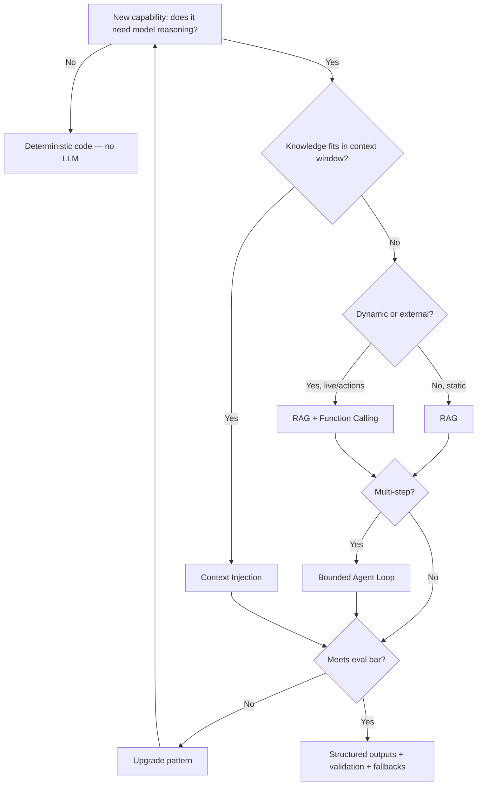

# 04.01 LLM Application Patterns

> **Positioning:** Choosing and engineering the core application patterns — RAG, tool use, agent loops, structured outputs, context injection — that turn foundation models into dependable product behavior.

## Why This Matters

A junior wires up a framework's RAG chain and ships whatever it outputs. A senior owns the architecture behind the pattern: why retrieval quality is what it is, when a tool call beats pre-computed context, where a loop must stop, what the output contract is, and how the system degrades when the model misbehaves.

## Topics (planned)

| # | Topic | Senior focus |
|---|---|---|
| 01 | `01_Retrieval_Augmented_Generation.md` | Owning retrieval quality: chunking, hybrid search, reranking |
| 02 | `02_Function_Calling_and_Tool_Use.md` | Designing tool contracts the model can follow reliably |
| 03 | `03_Agent_Loops_and_Orchestration.md` | Bounding loops: iteration/token/time limits + failure exit |
| 04 | `04_Structured_Outputs_and_Schema_Enforcement.md` | Machine-verifiable, retryable outputs |
| 05 | `05_Context_Injection_Patterns.md` | Budgeting and composing context as architecture |
| 06 | `06_Pattern_Selection_and_Fallback_Design.md` | Cheapest reliable pattern + graceful degradation |

## Pattern Selection Flow

## Key Principles

- Start with the simplest pattern that meets the quality bar; upgrade only when eval says so
- Retrieval quality determines generation quality — debug the retriever before blaming the model
- Every tool call is a contract: schema-defined, argument-validated, blast-radius-bounded
- Agent loops get three bounds (iterations, tokens, time) and a defined failure exit, always
- Structured outputs are the norm; free text must justify itself
- Fallbacks are architecture, designed per failure class

## Anti-Patterns

| Anti-pattern | Why it fails | Better |
|---|---|---|
| Agent loop for a single retrieval | 5–10x cost for one lookup | Context injection or plain RAG |
| Blaming the model for bad answers | Failure usually lives in retrieval/context | Measure retrieval + generation quality separately |
| Trusting LLM-chosen tool args | Hallucinated calls hit real systems | Schema + validation before execution |
| Loop with no budget limit | Runaway cost, hung requests | Hard limits + partial-result exit |
| Regex-parsing free-text output | Brittle, breaks on phrasing drift | Schema-constrained + validation |

## Seed File

- [[10_LLM_Production_Patterns]] — broad survey (copied from swe-knowledge)

## Sources

- [[10_Source_Index]] — Chip Huyen *AI Engineering*, Anthropic *Building Effective Agents*

## Related

- [[04_Applied_AI_Engineering/00_overview]] — [[02_Context_and_Prompt_Engineering/00_overview]] — [[07_Multi_Agent_and_Orchestration/00_overview]]
