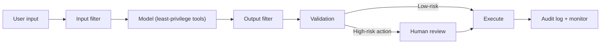

# 04.04 AI Security and Guardrails

> **Positioning:** Prompt injection is an **unsolved problem class** — design assuming hostile input reaches the model. Defense in depth is the baseline, not the ceiling.

## Why This Matters

A narrowly scoped agent can **still leak the data inside its narrow scope** — so scoping down is *not* a substitute for sanitizing inputs and monitoring behavior. This is the concept where I am bluntest:

> **There is no complete defense. You build defense-in-depth and you monitor for abuse, because something *will* get through.**

## Topics (planned)

| # | Topic | Focus |
|---|---|---|
| 01 | `01_LLM_Threat_Modeling.md` | OWASP LLM Top 10 mapped to your system |
| 02 | `02_Prompt_Injection_Defense.md` | Direct + indirect injection; why it's unsolved |
| 03 | `03_Data_Leakage_and_Privacy_Controls.md` | PII in context, training data memorization |
| 04 | `04_Input_Output_Guardrails.md` | Input filter → model → output filter → fallback |
| 05 | `05_Model_Supply_Chain_and_Tool_Security.md` | Model provenance, tool least-privilege |
| 06 | `06_Incident_Response_for_AI_Abuse.md` | What happens when injection succeeds |

## Defense-in-Depth Layers

## Key Principles

- Assume hostile input reaches the model — always
- Input filter → model → output filter → least-privilege tools → human review for high-risk
- Scoping down ≠ safe; a narrow agent still leaks narrow data
- Monitor for abuse, because defense will be pierced
- Tools get least-privilege: never give an agent more access than the task needs

## OWASP LLM Top 10 (2025) — the baseline checklist

The 2025 edition is the current reference. Map each entry to your system. Re-verify on new edition release.

## Seed Files

- [[11_Prompt_Engineering_and_Security]] — broad (copied from swe-knowledge)
- [[13_LLM_Evaluation_and_Guardrails]] — broad (copied from swe-knowledge)

## Sources

- [[10_Source_Index]] — OWASP LLM Top 10 verified 2026-09-19

## Related

- [[04_Applied_AI_Engineering/00_overview]] — [[06_Governance_and_Responsible_AI/00_overview]] — [[01_LLM_Application_Patterns/00_overview]] (tool security)
