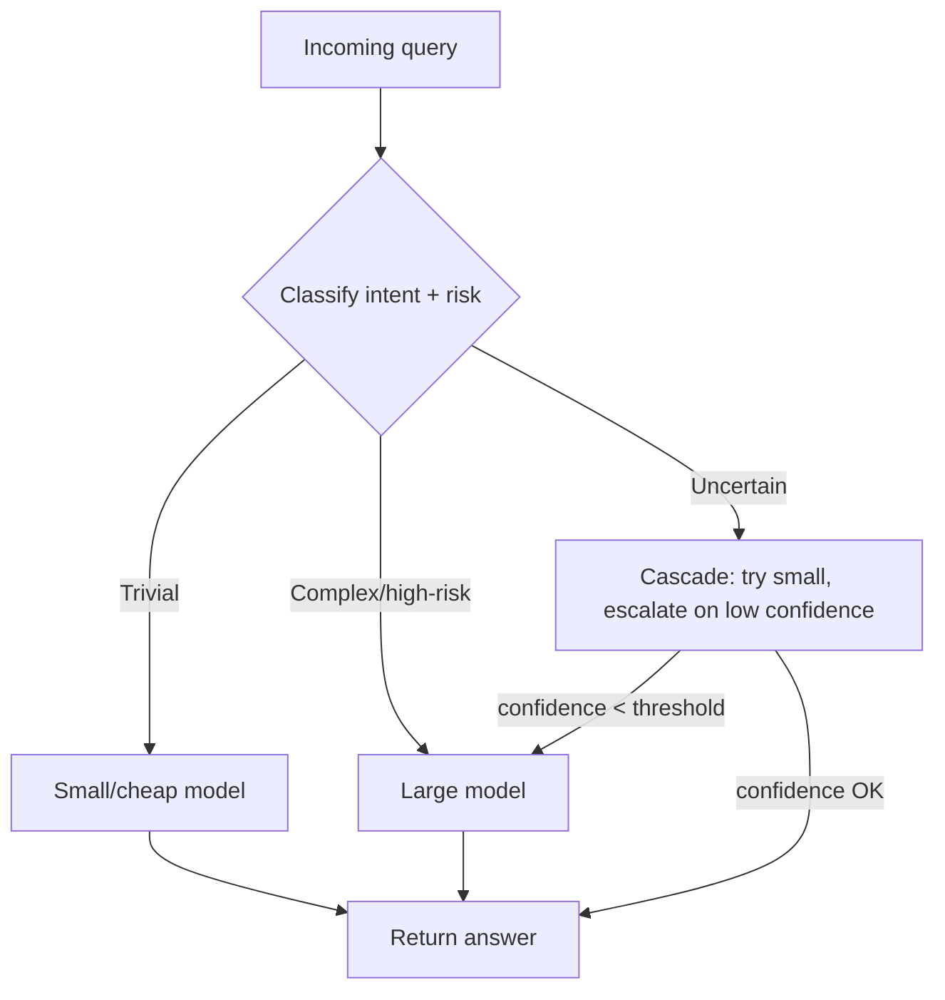

# 04.05 Model and Inference Operations

> **Positioning:** Cost and latency are features, not overhead. Static single-model deployment is now the anti-pattern.

## Why This Matters

Unit economics kill AI products more often than quality does. The 2026 consensus: match model tier to query risk from day one — don't bolt routing on after the bill scares you.

## Topics (planned)

| # | Topic | Focus |
|---|---|---|
| 01 | `01_Model_Selection_and_Benchmarks.md` | Choosing models by measured capability, not hype |
| 02 | `02_API_vs_Self_Hosted_Tradeoffs.md` | When to self-host (control, cost at scale) vs API (speed, no ops) |
| 03 | `03_Model_Routing_and_Cascading.md` | Route by intent + risk: small/cheap → large/strong |
| 04 | `04_Cost_Optimization.md` | Token economics, caching, batching |
| 05 | `05_Latency_Engineering.md` | p95 latency as a design constraint |
| 06 | `06_Caching_and_Batching.md` | Semantic caching, request batching |
| 07 | `07_Provider_Management.md` | Multi-provider, fallback, avoiding lock-in |

## Model Routing Pattern

## Key Principles

- Cost + latency belong in the design doc next to accuracy
- Route by intent + risk: not every query needs the biggest model
- Caching (especially semantic caching) is the highest-ROI cost lever
- Self-host only when API cost at your volume justifies the ops burden
- Multi-provider from day one — avoid lock-in, enable fallback

## Thai Speaker Traps

⚠️ "Inference" (in ML context) ≠ การอนุมานเชิงตรรกะ = การรันโมเดลเพื่อได้ผลลัพธ์ (running the model to produce output)

## Sources

- [[10_Source_Index]] — arXiv 2603.04445 (dynamic model routing) verified 2026-09-19

## Related

- [[04_Applied_AI_Engineering/00_overview]] — [[05_AI_Operations_and_MLOps/00_overview]] — [[03_Foundation_Models_and_LLMs/00_overview]]
