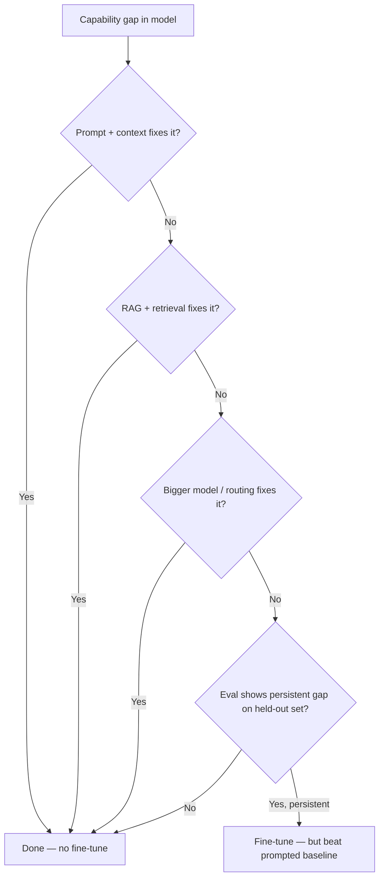

# 04.06 Fine-Tuning Strategy

> **Positioning:** Fine-tuning is **rarely worth it**. For ~90% of product needs in 2026, RAG + prompting + routing beats it. Learn when it's the right tool, not how to do it by default.

## Why This Matters

Fine-tuning is the most over-prescribed AI technique. Engineers reach for it when the actual problem is retrieval quality, prompt design, or model routing. The senior engineer's job is to say **"no, try RAG + a better prompt first"** out loud.

## Topics (planned)

| # | Topic | Focus |
|---|---|---|
| 01 | `01_When_to_Fine_Tune.md` | Decision tree: RAG-first, fine-tune only when eval says so |
| 02 | `02_SFT_vs_LoRA_vs_Full.md` | Full SFT vs LoRA/QLoRA vs RAG — trade-offs |
| 03 | `03_Data_Requirements.md` | How much data, what quality, format |
| 04 | `04_Evaluating_Fine_Tuned_vs_Prompted.md` | Must beat prompted baseline by clear margin |
| 05 | `05_Alignment_Methods.md` | SFT, RLHF, DPO — when each applies |
| 06 | `06_Cost_and_Compute.md` | GPU cost, time, iteration speed |

## Decision: Fine-Tune or Not?

## Key Principles

- Fine-tune is the **last** lever, not the first
- RAG + prompting + routing beats fine-tuning for ~90% of needs
- If fine-tuning doesn't beat a prompted baseline on held-out eval, it failed — don't ship it
- Data quality > data quantity for SFT; 100 high-quality examples beat 10k noisy ones
- LoRA/QLoRA is usually the right method (parameter-efficient, cheap, reversible)
- Full fine-tuning is rarely justified for applied work

## Anti-Patterns

| Anti-pattern | Why it fails |
|---|---|
| Fine-tuning to fix retrieval quality | The model can't use docs it never retrieved |
| Fine-tuning without a prompted baseline | Can't prove the fine-tune added value |
| Full fine-tune when LoRA would do | 10x cost for marginal gain, catastrophic forgetting risk |

## Sources

- [[10_Source_Index]] — Sebastian Raschka's magazine (best independent fine-tuning analysis)

## Related

- [[04_Applied_AI_Engineering/00_overview]] — [[05_Model_and_Inference_Operations/00_overview]] — [[03_Foundation_Models_and_LLMs/00_overview]] (alignment)
