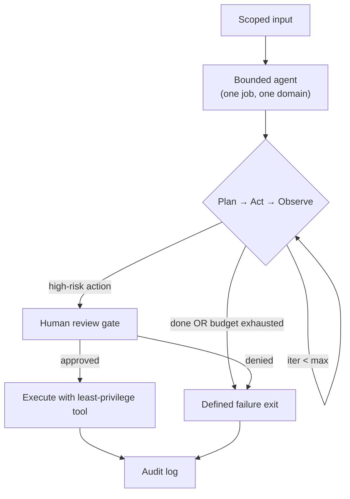

# 04.07 Multi-Agent and Orchestration

> **Positioning:** The 2026 shift is unmistakable: "general autonomous agent" lost; **bounded/vertical agents** won. One job, one industry, least-privilege tools, audit trail.

## Why This Matters

General agents were the 2024-2025 hype. Bounded agents are the 2026 reality because:
- Narrow scope → evaluable trajectories
- Narrow scope → least-privilege tool surface → smaller blast radius
- Narrow scope → cheaper (route to smaller models)
- Narrow scope → auditable (one job, one audit trail)

> **"Should this even be a general agent?" is almost always answered no.** Scope it down, then ask whether you need an agent at all — a deterministic pipeline may win.

## Topics (planned)

| # | Topic | Focus |
|---|---|---|
| 01 | `01_Bounded_vs_General_Agents.md` | Why narrow won; scoping decisions |
| 02 | `02_Vertical_AI_Agents.md` | One job, one industry — domain rules + SOPs |
| 03 | `03_Agent_Loop_Bounds.md` | Iteration/token/time limits + failure exit |
| 04 | `04_Trajectory_Evaluation.md` | Every step, every tool call, cohort analysis |
| 05 | `05_Multi_Agent_Orchestration.md` | When multiple agents help (rarely) and when they don't |
| 06 | `06_Human_in_the_Loop.md` | High-risk actions need human review — pattern design |
| 07 | `07_Agent_Security.md` | Scoping ≠ safe; monitoring for abuse |

## Bounded Agent Anatomy

## Key Principles

- Default to "no agent" — deterministic pipelines win when they work
- If an agent: bound it (one job, one domain, least-privilege tools)
- Every loop has three bounds: iterations, tokens, time — and a defined failure exit
- Trajectory eval: filter by `failed agent → trajectory → step`, compare against golden trajectories
- High-risk actions go through a human review gate, always
- "It ran" ≠ "it's safe to ship" — you need trace-level evidence

## Anti-Patterns

| Anti-pattern | Why it fails |
|---|---|
| General-purpose agent for a narrow task | Unevaluable, unsafe, expensive |
| Agent loop with no bounds | Runaway cost, hung requests |
| Trusting the agent "did the work" | Can't verify without the trace |
| Multi-agent when one agent (or no agent) would do | Coordination overhead, more failure modes |

## Sources

- [[10_Source_Index]] — Anthropic *Building Effective Agents*; Kateria Wynn trajectory eval

## Related

- [[04_Applied_AI_Engineering/00_overview]] — [[01_LLM_Application_Patterns/00_overview]] (agent loops) — [[03_Evaluation_and_Observability/00_overview]] (trajectory eval) — [[04_AI_Security_and_Guardrails/00_overview]] (agent security)
