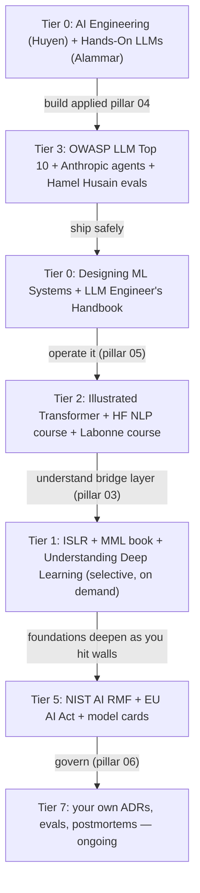

# AI Engineering Knowledge Vault

> **Purpose:** A dedicated Obsidian vault for AI engineering — fundamental *and* applied. Built from the structure proposed in `oralita_md/personal/ai/ai-engineering-knowledge-vault-proposal.md`, decided 2026-09-19.

---

## Why This Vault Exists

No mature body of knowledge exists for AI engineering the way SWEBOK covers software engineering. This vault is built in **two layers** with different sourcing strategies:

- **Slow-churn foundations** (01–02): textbook-grounded, stable. Safe to cite from memory.
- **Fast-churn applied** (03–05): books + **web-verified current practice**. Re-verify before citing in any ADR or recommending to a stakeholder.

> ⚠️ **Core rule:** "It works on my examples" is the most expensive sentence in AI engineering. Everything in pillars 03–05 must be web-verified before it ships.

---

## Vault Map

| Pillar | Focus | Churn | Sourcing |
|---|---|---|---|
| [[01_Foundations/00_overview\|01 Foundations]] | Math, statistics, optimization, computing for ML | 🔵 Slow | Textbooks |
| [[02_Core_Machine_Learning/00_overview\|02 Core ML]] | Classical ML, neural networks, deep learning architectures | 🔵 Slow | Textbooks + canonical papers |
| [[03_Foundation_Models_and_LLMs/00_overview\|03 Foundation Models & LLMs]] | Transformers, pretraining, alignment, tokenization, capabilities | 🟡 Medium | Papers + technical reports |
| [[04_Applied_AI_Engineering/00_overview\|04 Applied AI Engineering]] | RAG, agents, evals, guardrails, context engineering, fine-tuning | 🟠 Fast | Books + **web-verify per citation** |
| [[05_AI_Operations_and_MLOps/00_overview\|05 AI Ops & MLOps]] | Serving infra, monitoring, CI eval gates, drift | 🟡 Medium | Docs + benchmarks |
| [[06_Governance_and_Responsible_AI/00_overview\|06 Governance & Responsible AI]] | Risk, ethics, regulation, compliance, ROI | 🟡 Medium | Official frameworks |
| [[07_Specialized_Domains/00_overview\|07 Specialized Domains]] | NLP, CV, audio, multimodal, AI-for-code | Variable | Domain-specific |
| [[08_Practitioner_Notes/00_overview\|08 Practitioner Notes]] | Your ADRs, eval suites, postmortems, tooling reviews | N/A | First-hand |

---

## How to Read This Vault

**Applied-first path** (recommended for working engineers):

> **Anti-pattern:** front-loading 4 semesters of math before touching an API. Foundations built on demand, when you hit a wall, stick. Front-loaded theory without application is forgotten.

Full reading list: [[09_Reading_List]]

---

## Build Status

| Phase | Status | Notes |
|---|---|---|
| **Phase 1** — Applied pillar 04 + vault root | 🟢 Done | 8 sub-area overviews authored; 3 seed files copied |
| **Phase 2** — Foundation Models & LLMs (03) | ⬜ Pending | Next: transformer architecture + alignment |
| **Phase 3** — Core ML (02) | ⬜ On demand | Build as you hit walls |
| **Phase 4** — Foundations (01) | ⬜ On demand | 5 seed files already copied |
| **Phase 5** — AI Ops (05) + Governance (06) | ⬜ On demand | When responsible for production + compliance |
| **Phase 6** — Specialized (07) + Practitioner (08) | ⬜ Ongoing | Depth + your own case studies |

---

## Seed Files (copied from swe-knowledge)

These 14 notes were copied from `swe-knowledge/computing-foundation-note/Artificial_Intelligence/` as starter content. They are survey-style; deepen as needed:

| Copied to | File | Origin |
|---|---|---|
| `01_Foundations/` | AI Overview.md, 01_AI_Foundations.md, 02_Search_and_CSP.md, 03_Logic_and_Reasoning.md, 04_Uncertainty_and_Decisions.md | Classical AI |
| `02_Core_Machine_Learning/` | 05_Machine_Learning.md, 06_Reinforcement_Learning.md | Classical ML + RL |
| `04_Applied_AI_Engineering/` | 10_LLM_Production_Patterns.md, 11_Prompt_Engineering_and_Security.md, 13_LLM_Evaluation_and_Guardrails.md | LLM-era (broad) |
| `06_Governance_and_Responsible_AI/` | 08_AI_Ethics_and_Future.md, 12_AI_ROI_and_Roadmap.md | Ethics + ROI |
| `07_Specialized_Domains/` | 07_NLP_and_Perception.md, 09_AI_SE_Intersection.md | NLP + AI↔SE |

> The originals in `swe-knowledge/` are the canonical source for the SE career path. These copies diverge from here — update them with AI-engineering depth.

---

## Conventions

- **Numbering:** two-digit prefix, underscore, Title_Case (e.g., `01_Retrieval_Augmented_Generation.md`)
- **Each folder:** `00_overview.md` as the entry point
- **Wikilinks:** `[[Hyphenated-Name]]` — **NEVER spaces** (broken-backlink rule, fixed across 172+ docs mid-session)
- **Mermaid edge labels with special chars:** quoted, e.g. `|"label with ()/"|`
- **Frontmatter:** `title`, `note_type`, `tags`, `status`, `source` (minimum)
- **Per note:** positioning callout, "why this matters", key concepts, anti-patterns, cross-links, sources with verification date
- **Language:** English only (source fidelity)
- **Thai Speaker Traps:** flag English AI terms Thai speakers commonly misuse, where relevant

---

## Related

- Sibling vault: [[swe-knowledge/Computing Foundation Overview|SWE Knowledge Vault]]
- Career path (role view): [[career-path/18_Applied_AI_Engineer/00_overview|Applied AI Engineer career path]]
- Proposal doc: `oralita_md/personal/ai/ai-engineering-knowledge-vault-proposal.md`
- Reading list: [[09_Reading_List]]
- Source index: [[10_Source_Index]]
- Glossary: [[11_Glossary]]

---

*Vault created 2026-09-19 by LLMOps 🦙. Structure grounded in existing `swe-knowledge/` conventions. Sources web-verified 2026-09-19.*
